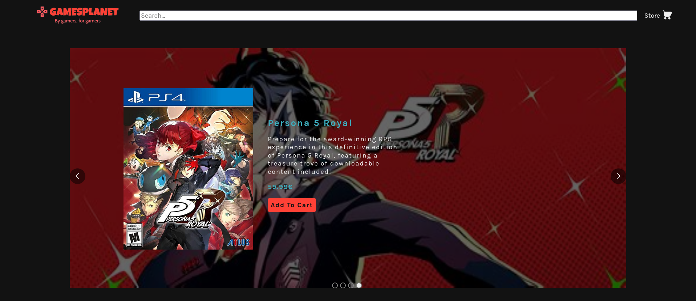
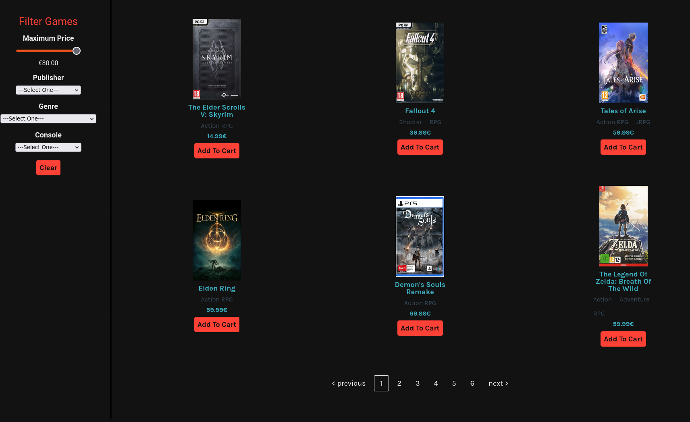
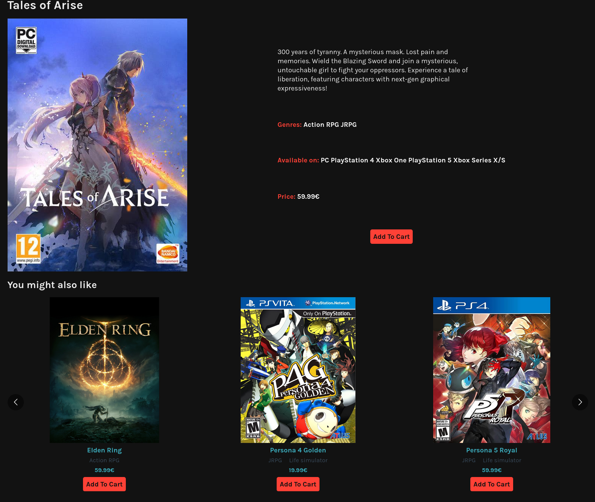
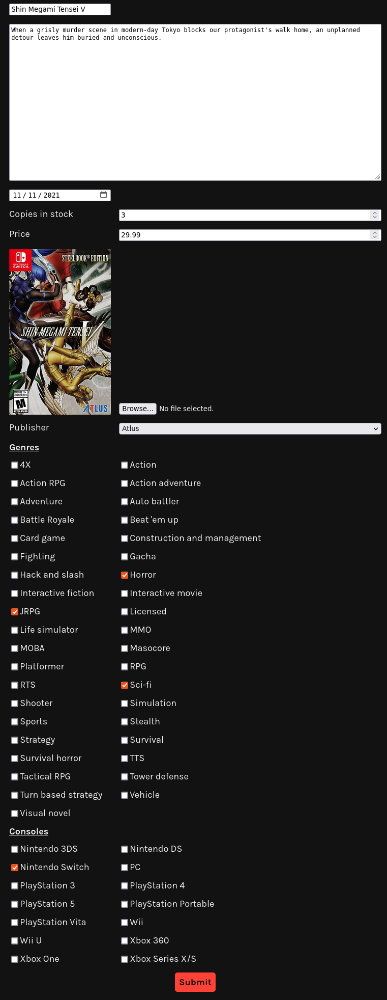

# game_store



A full MERN stack website, meant to mimic an online videogame store. See it live [here](https://bofmar.github.io/game_store). To access the control panel, click the link on the footer, or navigate to [https://bofmar.github.io/game_store/#/control-panel](https://bofmar.github.io/game_store/#/control-panel).

The website is deployed to render.com and uses the free tier. As such initial load time can reach up to a minute if you access this site while the backend has spun down. Please be patient.

## Features
* ### Store functionality
  
  Users can browse the store for games to 'buy'. The games are paginated using [react-paginate](https://www.npmjs.com/package/react-paginate), and can be filtered with the controls in the sidebar.
  Games can be added to the user's cart and the user can check out to complete their 'purchase'. Doing so will update the game's remaining copies in the database. Guards have been placed to prevent users from buying games with no copies left, or buying more copies of a game than what is actually available. The graphics used for the credit card info come from [react-credit-cards](https://www.npmjs.com/package/react-credit-cards).
* ### Recommendations
  
  When looking at a specific game's page, users are suggested similar games, presented in a carousel. This carousel, along with the rest on the site are made with [react-responsive-carousel](https://github.com/leandrowd/react-responsive-carousel). Recommendations are picked by comparing all the games in the db to the one currently viewed, and applying a score to them depending on how similar they are (eg if they share genres, consoles and publishers).
* ### CRUD operations
  
  Users can do all CRUD operations on the Games, Genres, Publishers, and Consoles, by accessing the [control panel](https://bofmar.github.io/game_store/control-panel). The changes are saved to a MongoDB cluster,via [Mongoose](https://mongoosejs.com). Validation of the forms used is done both on the frontend and on the backend using express-validator(https://express-validator.github.io/docs/).
* ### Search functionality
  The search bar in the navigation menu can be used to search for games in the database. This is achieved by providing the search input with a datalist derived from the database.

  ```js
  <form onSubmit={e => handleSearch(e)}>
    <input type="search" placeholder="Search..." list="game-titles" value={searchString} onChange={e => setSearchString(e.target.value)}/>
    <datalist id="game-titles">
      {games && games.map(game => <option key={game._id} value={game.title}></option>)}
    </datalist>
  </form>
  ```
## About
The site is made using Typescript. React via Vite was used for the frontend along with [react-router](https://reactrouter.com/en/main). The backend uses Node + Express. CORS is handled by the Express middleware [cors](https://www.npmjs.com/package/cors). Images are handled with [Multer](https://github.com/expressjs/multer). The toasts used throughout the frontend are made with [react-toastify](https://www.npmjs.com/package/react-toastify). The backend is deployed to [Render](https://render.com/). Loading spinners are taken from [react-spinners](https://www.npmjs.com/package/react-spinners).
